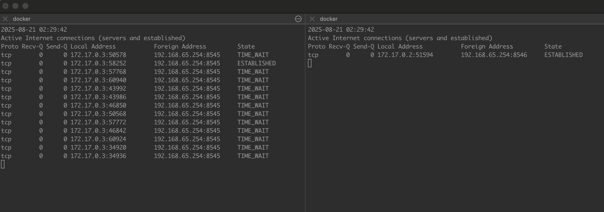

# Provider Connection Pool
This repository allows you to observe the connection pool of provider communications between the client and the blockchain node through logs.

When you run the `Make` CLI, the client repeatedly calls `eth_getBlockNumber` using the provider implemented with `ethers.ts`, according to the configured number of times and delay interval. **During this process, you can compare the behavior of the `JsonRpcProvider` and the `WebSocketProvider` connection pools.**

## Quick start
> [!IMPORTANT] 
> Provider calls are executed inside the Docker container’s virtual environment (VM). Therefore, **Docker is required**.

### Options
|              	| description                                                 	| default 	|
|--------------	|-------------------------------------------------------------	|---------	|
| PROVIDER_URL 	| Provider URL. Must start with either http(https) or ws(wss).	|         	|
| RETRY_COUNT  	| Provider Call Count. (Set to 0 for infinite calls)          	| 0       	|
| DELAY_MS     	| Delay time (in milliseconds) between each call.             	| 5000(5s) 	|


#### View RPC-Provider Connection pool
```
make rpc PROVIDER_URL=https:// ...
```

#### View Websocket-Provider Connection pool
```
make ws PROVIDER_URL=wws:// ...
```

## Connection Pool Logs


> Left: JsonRpcProvider  Right: WebSocketProvider </br>
> Both executed at the same time — observe the difference in their connection pool behavior.
